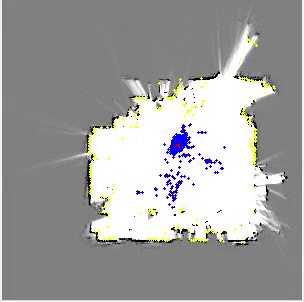

# Monte Carlo localization using 2D LiDAR on Robot Operating System (ROS)

---

### Dependency libraries

* Eigen (default version of ROS)
* opencv (default version of ROS)
---

## Results

### MCL

---
## Usage

<pre><code>$ roscore</code></pre>

0. Setting
    1. Download this repository 
    <pre><code>git clone https://github.com/GIN-zhao/ROS-MCL-2D-LIDAR.git</code></pre>
    2. Build this ros code as follows.
    <pre><code>cd $project/script </code></pre>

    <pre><code>bash quick-build.sh </code></pre>

1.  MCL

    1. Move to the repository e.g
  
    <pre><code>cd $project </code></pre>
    <pre><code>source $project/catkin_ws/devel/setup.bash </code></pre>

    2. Play rosbag **hw2_data.bag**

    <pre><code>$ rosbag play rosbag/hw2_data.bag</code></pre>

    3. Change the paths of png: 7 and 8th lines on the hw_slam/mcl_/src/mcl.cpp
    
    4. Run MCL code

    <pre><code>$ rosrun hw_slam mcl_ros</code></pre>

