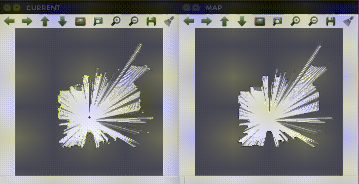

# Monte Carlo localization using 2D LiDAR on Robot Operating System (ROS)

---

### Dependency libraries

* Eigen (default version of ROS)
* opencv (default version of ROS)
---

## Results

### Mapgen

### MCL

---
## Usage

<pre><code>$ roscore</code></pre>

0. Setting
    1. Download this repository 
    <pre><code>$ cd /home/$usr_name/catkin_ws/src</code></pre>
    <pre><code>$ git clone https://github.com/GIN-zhao/ROS-MCL-2D-LIDAR.git</code></pre>
    2. Build this ros code as follows.
    <pre><code>$ cd /home/$usr_name/catkin_ws</code></pre>
    <pre><code>$ catkin_make re510_slam</code></pre>

    Or if you use catkin-tools, then type below line on the command
    <pre><code>$ catkin build re510_slam</code></pre>

 MCL

    1. Move to the repository e.g,
  
    <pre><code>$ cd /home/$usr_name/catkin_ws/src/mcl_2d_lidar_ros</code></pre>

    2. Play rosbag **re510_mcl.bag**

    <pre><code>$ rosbag play rosbag/re510_mcl.bag</code></pre>

    3. Change the paths of png: 7 and 8th lines on the re510_slam/rs_mcl/src/mcl.cpp
    
    4. Run MCL code

    <pre><code>$ rosrun re510_slam rs_mcl</code></pre>

## Consideration

**/vrpn_client_node/turtleBot/pose**: Pose captured from OptiTrack, which is a motion caputre system(Ground Truth).

**/odom**: 2D pose from Turtlebot2.

**/scan**: 2D LiDAR data measured by RP LiDAR A1M8.

